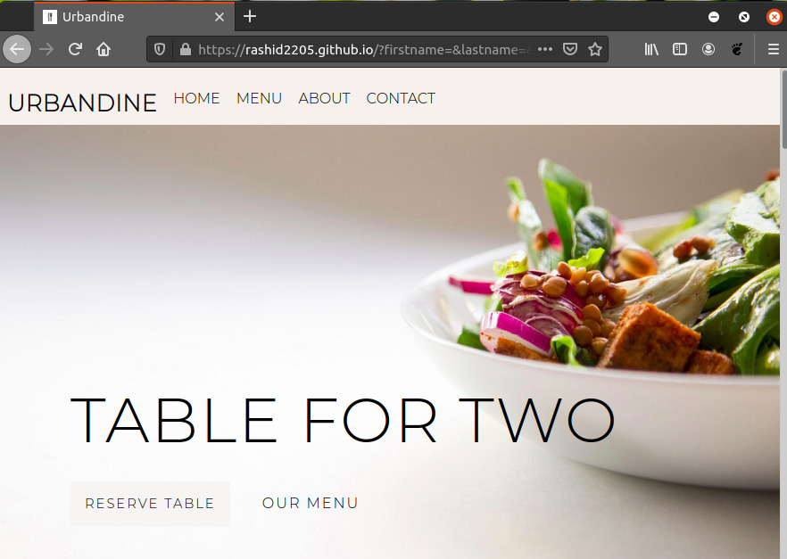

# URBANDINE-A Simple Website

# Description

A landing page for *URBANDINE* a restaurant.It employs the use of HTML, CSS and Javascript to build it. A simple but responsive website.

At present it is just a static website with less dynamic functionalities.
But in future we can implement more dynamic functionality and make it as a food-delivery website.

## Have a look

[Urbandine](https://rashid2205.github.io/)


## Preview


 
## Tech Stack

* HTML
* CSS
* Javacript

## Contribute

Start contributing

## Clone the repository

``` ​
$ git clone https://github.com/rashid2205/rashid2205.github.io.git
```

## License
[MIT](https://choosealicense.com/licenses/mit/)
